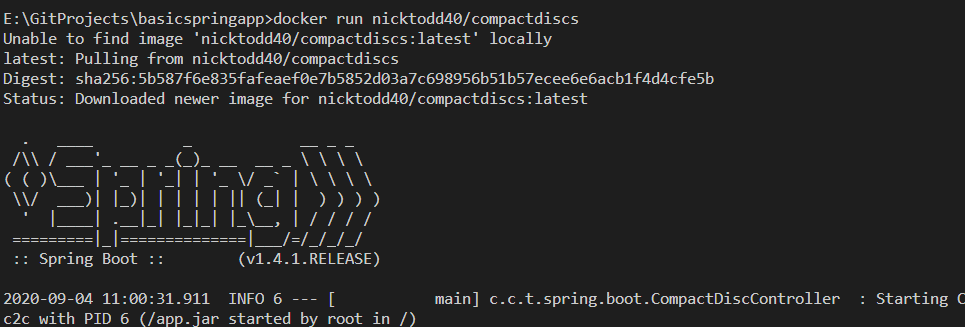
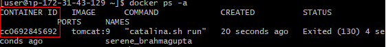
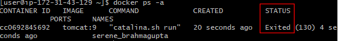
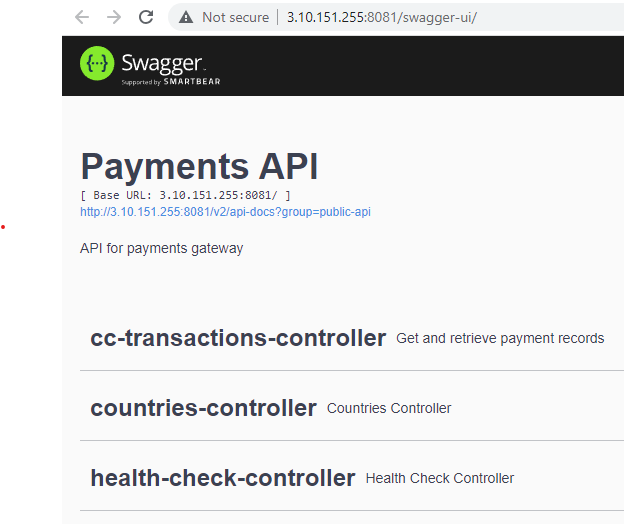

# Lab 1 - Working with Docker
In this first exercise, you will see how to obtain Docker images from a registry such as Artifactory. We will then run an example Docker image as a container in our Virtual Machine, and finally we will explore the container lifecycle.

## Before you Begin
Any installation of Docker can be used for this exercise. If you don't have Docker installed anywhere, You can use the Docker Playground

To use the playground, open a Web browser, and visit https://labs.play-with-docker.com/ and create an account. 

Once you have a terminal available on a machine that is running Docker you can proceed.

## Part 1: Check your Docker Installation

1. To check that Docker is installed, run the following docker CLI command:

```docker --version ```

2. You wil see a version number returned. If you see Command Not Found, check that you do indeed have Docker installed!
   
## Part 2: Run a Container

Let's run up a container. We will use an image containing Tomcat, a popular web server for Java applications. We'll get the image from the default registry, which is called Dockerhub.

1. Initially, let's just run the container in the simplest way. Run the following command.

 ```docker run tomcat:9 ```

First, you will see the image download along with some other image layers which will be explained later. This can sometimes take a few minutes and it might seem like nothing is happening. Just be patient with your network. Once the image has downloaded, the container will launch and you will see the output to the console.

An example of the kind of output you will see is shown below:



2. Once it is complete, you have successfully started a container running the Tomcat web server, although we can't see it just yet. You will notice that you have 'lost' your terminal since the docker container is now running in the foreground. To get your terminal back, use **Ctrl-C**. If **Ctrl-C** doesn't work, simply create a new terminal and SSH into your machine again.
    
3. What has happened to the container? Is it still running? We can find out using docker ps -a. The -a means "all", including stopped containers.

```docker ps -a```

4. Every container is given a uniqe ID which is shown in the first column. 



Make a note of the first two characters of the ID (in the example below that is "cc").

5. The container status is shown in the STATUS column - it should say "Exited" which means that it has stopped running.



If the container status shows the value "Up", which may be the case if using Ctrl-C didn't work, run the following command to stop the container, using the first 2 digits of your container's ID and without the square brackets.

```docker stop [2 digits]```

The terminal will respond with the same 2 digits back. Now run ps -a again to check the container is stopped.

```docker ps -a```

6. The stopped container can be turned back on, and this time it will be running in the background. Using the first two digits of your container's ID, run the following command without the square brackets:

```docker start [2 digits]```

7. The response is simply the same two digits returned back. The container should be running. Verify that the status of the container is "Up" with docker ps again.

```docker ps```

8. Now destroy the container. This is done using rm. The container is running so we will have to add a -f flag to force it.

```docker rm -f [2 digits]```

9. You can verify its destruction using docker ps -a.

```docker ps -a```

## Part 3 Adding Routing

You will now run a container that contains a simple Spring Boot Application. The source code for the application we will be deploying can be found at <https://github.com/vppmatt/paymentgateway-standalone>. It is a basic Spring Boot application sample. You will see the source code in a later exercise.

The image for this application is hosted on a different repository (part of the Amazon AWS cloud services). For this reason we need to include the full URL of the image.

1. Launch a container from the image, but this time with two attributes
   - **-d** to run it in the background (detached)
   - **-p 8081:8080** to handle the routing

 ```docker run -d -p 8081:8080 public.ecr.aws/multicode/payment-gateway:latest ```

 2. When the container is running, you'll be presented with the id of the container. 

The -p 8081:8080 is mapping the ports. the 8081 on the left is the VM (referred to as the Docker host) and the 8080 on the right is the container port, since Spring Boot applications run on port 8080.

3. You can now visit your Spring Boot application from the browser:

```http://[hostname]:8081```

For example, on a local machine, the hostname will be localhost.

You can now see the running application in your browser:



This means that you are now visiting a Docker container, running in a Docker host, via port forwarding from a browser. That is pretty cool!

4. Finally, terminate your container using docker rm -f [2 digits]. You can work out how to find the two digits (hint: use docker ps).


## Review
Congratulations. You have now successfully  downloaded and launched a docker container, and then configured the ports so it can be accessed externally.

In the next exercise, you will see how you can work with images, creating your own images and also managing the images that you have on your local VM.

