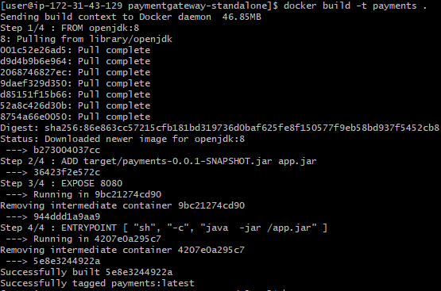

# Lab 2 - Working with Docker Images
In this exercise, you will now see how to work with Docker images. Specifically you will see how to create and then run your own images from Dockerfiles. We will take a sample Spring Boot application and get it into an image so we can run it as a container. To do this we'll create an image which builds the jar file. This is the same application as the container you launched in the previous exercise however we will now start from the project's source code.

## Before you Begin
You will need to be logged into a machine that has Docker installed, or you will need to be logged into the Docker playground.

## Part 1: Overview of the build process
The source code for our simple Spring Boot application is contained in the following git repository (you can visit this URL in your web browser): 

<https://github.com/vppmatt/paymentgateway-standalone>

To build and run this applicaiton on your computer without Docker (**do not do this!**) the steps would be as follows:

First we would get a copy of the code by using the git clone command:

```git clone https://github.com/vppmatt/paymentgateway-standalone.git```

The application code will be placed in a new folder. We would navigate into that folder with: 

```cd paymentgateway-standalone```

 Inside this folder is a command we can run called mvnw. This can be used to build the jar file. We first need to make sure this command is runnable by entering:

```chmod a+x mvnw```

Then we can execute the command to build the jar file with

```./mvnw package```

The jar file will be placed in a sub folder named `target` and is called `payments-0.0.1-SNAPSHOT.jar`.

We do **not** want to do this process directly on the machine we are using, as it will require us to first install and configure the required software, such as git and Java. Instead we will therefore run this entire build process inside its own docker container. This approach also means we can guarantee that whenever we build our project, it is in a clean environment and is a fully repeatable exercise.

## Part 2: Create a working folder
**This step is only required if you are using a shared server, to keep your work separate from other users of the same server**

1. **Create a folder for your own use** using the following command. Substitute your own name for the part in [].

```md [your-name]```

2. **Navigate into that folder** with 

```cd [your-name]```

## Part 3: Create a Dockerfile for the build container

We will now create a Dockerfile for an image with the purpose of building the Spring application's jar file. The container will be short-lived (sometimes called ephemeral). We will start the container, use it to build the jar file, copy the jar file from the container to our local machine and then destroy the container. 

1. We will first **create a script file** which will run the build process - this script will be executed **inside** the docker container.  **Run the following command** (note that this assumes you are going to use nano. Feel free to create the file some other way if you prefer):

```nano build.sh```

You will be presented with the editor view. 

2. Edit the file so that it contains the steps required to create the jar file, as described in part 1:

```
#! /bin/bash
git clone https://github.com/vppmatt/paymentgateway-standalone.git
cd paymentgateway-standalone
chmod a+x mvnw
./mvnw package
```

3. To save the file, press **Ctrl+O**, then press **Enter**. To exit the editor, press **Ctrl+x**. 

4. Now to **create the Dockerfile** that will define the build container, **run the following command**:

```nano Dockerfile```

You will be presented with the editor view. 
   
3. The first thing we need to specify is the parent image. For this we will use a standard image that already includes the JRE and git. **So add the following line** to your Dockerfile.

```
FROM openjdk:8
```

4. Now we need to copy the script file we just created into the image. **Add in the following line**:

```
COPY build.sh build.sh
```

5. Before the container starts we want to make sure this file can be executed, so we will **insert a command** to change its attributes:

```
RUN chmod a+x build.sh
```

6. Finally, we need to specify what happens when the container launches, which is to execute our script. **Add the following line**:

```
ENTRYPOINT [ "sh", "-c", "./build.sh" ]
```


7. The complete Dockerfile should appear as shown below.

```
FROM openjdk:8
COPY build.sh build.sh
RUN  chmod a+x build.sh
ENTRYPOINT ["sh", "-c", "./build.sh"]
```

8. To save the file, press **Ctrl+O**, then press **Enter**. To exit the editor, press **Ctrl+x**. 


## Part 4: Create an image from the Dockerfile and then run it as a container.
We could build an image from this Dockerfile (**don't do this yet!**), then run the docker container from this image. Because the container is short-lived, when the build process has finished, the container will terminate. We need to then copy the jar file created inside the container to our local machine.

As this process requires a number of commands to be executed in sequence, and so that this process can be re-run in the future, we will create a script file containing the required steps.

1. Using your editor, **create a new file** called createJar.sh.

```nano createJar.sh```

2. **Edit the file contents** to look like this (replace [your-name] with your name)

```
if [ -d "./app.jar" ]
then
  rm -f app.jar
fi

docker build -t pgbuilder[yourname] .
docker run --name pgbc[yourname] pgbuilder[yourname]
docker cp pgbc[yourname]:/paymentgateway-standalone/target/payments-0.0.1-SNAPSHOT.jar app.jar
docker rm -f pgbc[yourname]
```

3. To save the file, press **Ctrl+O**, then press **Enter**. To exit the editor, press **Ctrl+x**. 

We'll now understand what this file is doing:

```
if [ -d "./app.jar" ]
then
  rm -f app.jar
fi
```

Because we could run the file multiple times, the jar file might already exist on our local machine, so we first check if it is there, and if it is we remove it.

```
docker build -t pgbuilder[yourname] .
```

This command creates an image from the Dockerfile you created. We are calling the image pgbuilder - here pg is a shorthand for payment gatgeway, the name of our application. Because multiple users will be sharing same machine for this exercise, we want to ensure that this image name is unique, so we are including our own name when naming the image. Take care to include the final period with this command to tell Docker that the Dockerfile is in the current folder.

```
docker run --name pgbc[yourname] pgbuilder[yourname]
```

This step starts the container. It gives the container a specific name, which again we want to be unique. (pgbc = payment gateway build container). We need to give the container a specific name so that we can extract files from it - if we don't do this we need to work out what ID the container has been given if we are to interact with it. 

Normally we use the `-d` argument to run containers in detatched mode, however in this instance we want to wait for the container to exit as this means that the build script will have finished and our jar file will hve been created. 

```
docker cp pgbc[yourname]:/paymentgateway-standalone/target/payments-0.0.1-SNAPSHOT.jar app.jar
```

This command will copy the jar file that was created inside the container to a local file which will be called app.jar. The container doesn't need to be running for this command to work. 

```
docker rm -f pgbc[yourname]
```

Finally we remove the container. We need to do that so that next time we execute our script a new container can be created with the same name. 


4. We are now finally ready to execute this script and build the jar file. **Run the following commands**:

```chmod a+x createJar.sh```

```./createJar.sh```

5. After a short while the process will finish. Enter the following command to **check that the jar file is now present** in your working folder:

```ls```

## Part 5 Create a Dockerfile to run the application

Now that we have built the jar file, we can create a further Dockerfile to define the image that will actually execute our applicaiton. 

Because we already have a file in our current folder called `Dockerfile`, we will name this one `AppDockerfile`. 

1. **Run the following command** to create the file and open the editor:

```nano AppDockerfile```

2. **Specify the same parent image** as we used for the builder container.

```
FROM openjdk:8
```

4. Now we need to **copy the JAR file** we created into the image.

```
COPY app.jar app.jar
```

5. To **specify which port** will need to be exposed upon launch, we can add an EXPOSE line, so add the following line to your Dockerfile:

```
EXPOSE 8080
```

This does not actually do anything with the ports automatically, but it tells us which is the default port to open. We will see how this is used in the next part. OpenShift also uses this information.

6. Finally, we need to specify what happens when the container launches, which is to **run the Jar**. Add the following line:

```
ENTRYPOINT [ "sh", "-c", "java  -jar /app.jar" ]
```

This line specifies to run a shell with the java command, specifying the fact it is a jar with -jar and then specifying the name of the Jar file. 

7. That's it. The Dockerfile is complete. It should appear as shown below. Just verify your file contents:

```
FROM openjdk:8
COPY app.jar app.jar
EXPOSE 8080
ENTRYPOINT [ "sh", "-c", "java  -jar /app.jar" ]
```

8. To save the file, press **Ctrl+O**, then press **Enter**. To exit the editor, press **Ctrl+x**. 
    
## Part 6 Build the Image and Run the Container

1. To build the image, we can use **docker build**. Remember we must specify a tag and then also the location of the Dockerfile. Because we are using a Dockerfile with a non standard name, we need to specify the file name with the -f flag.  **Run the following command** (take care to include the final period):

```docker build -t payments[your-name] -f AppDockerfile .```

This will download the parent image that we specified at the top of the Dockerfile, the along with all of its layers. Once that is complete it will then build the image for you.

The output will look something like the below:



2. Now the image is built, we can test it by running it as a container. To run it we can use an almost identical command to the one we used in Module 2. **Start the container** with the following:

```docker run -P -d payments[your-name]```

In this command the -P means "run the container exposing the default port" - a random port number will be assigned for the container (this was explained in the previous lab). Docker knows which port to map to in the container from the `EXPOSE 8080` line in teh Dockerfile.

The terminal will respond with the id of the container. 

3. You can view the logs from the container by running the command 

```docker logs [first few digits of the container ID]```

4. After a short while the application should be running. To test it in the browser, now visit the following URL:

```http://[server IP address]:[port number]/api/country```

You can also visit the root url for the application to view the API documentation.

```http://[server IP address]:[port number]```

5. Finally, terminate and destroy your container using `docker rm -f [the first few characters of the id of your container]`. 

## Review
Congratulations. You have successfully created 2 Dockerfiles. We used the first to create a docker image that when run as a container would build a jar file. We launched that container and extracted the jar file. We then created a second docker image to run the jar file as an application. You then launched that image as a container, and was able to view it running via a Web Browser. 

You may be wondering why we didn't push our image to the registry. It can be done with docker push, but we would need the relevant permissions to do that. 

In the next module, you will see how we can get this image running in OpenShift instead of using Docker standalone.