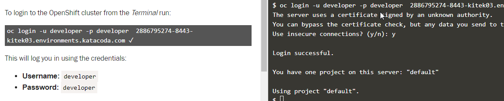
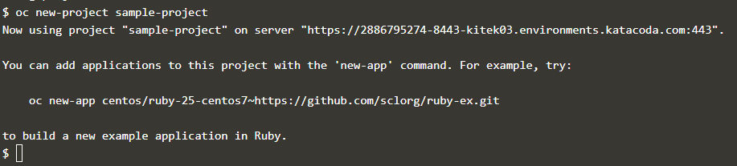
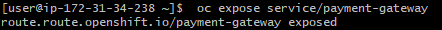
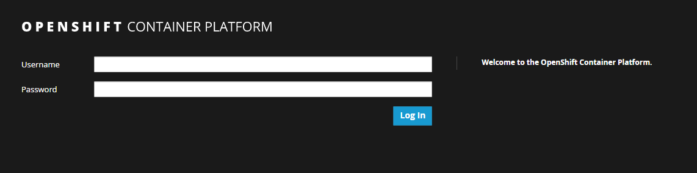
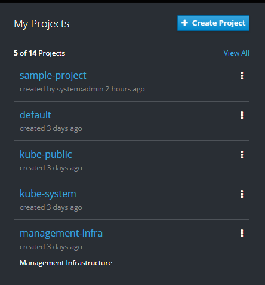
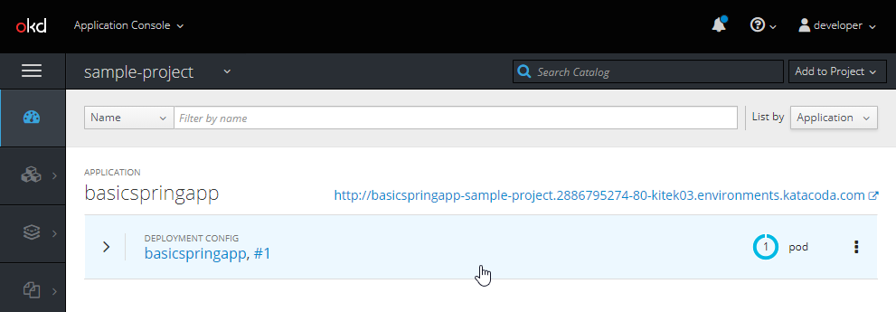

# Module 5 Working with OpenShift 3 - Docker at Scale
In this exercise, you will now see how to deploy our sample application to OpenShift. You can either use the OpenShift playground, or be logged into a machine with OpenShift installed. You will run a container from the terminal. You will then visit the Web based management console of OpenShift to configure the routing, and finally, you will test your application through the Web browser.

## Before you Begin
Before you begin, you will need a terminal on a machine with OpenShift installed. If none is available, then the OpenShift playground will work just fine. To use the OpenShift playground, visit the following URL:

https://learn.openshift.com/playgrounds/openshift311/

You will be using OpenShift 3.11 for this exercise. There is an OpenShift 4.x as well, but for this exercise, the differences are minor.


## Part 1: Logging in to OpenShift

1. At your terminal where you are logged into your VM (as per the prerequisites), run the following OpenShift command:

```oc login```

Note that if you are using the OpenShift playground, the Login command is provided for you.

1. You will be prompted to confirm which server, which will default to your localhost, so just press `Enter`.

2. You will now be prompted regarding using insecure connections. You can press `y` and then `Enter`.




## Part 2: Creating a new Project and Application
If you recall, OpenShift uses the concept of a project to act as a namespace for our applications. So we will create both. The application will be based upon the image that will be created from a project that is in Git.

1. To create a new project, run the following command:

```oc new-project sample-project```



2. You will now create a new project using a Docker image that is already in Dockerhub that is a basic Java REST APi with a simple Web page. To create the application within the project, you can point OpenShift directly to the Docker image. So run the following command:


```oc new-app nicktodd40/compactdiscs```

3. That's it! You have deployed the new application to OpenShift. Note the message you get after it has deployed. You can run `oc status` to see the state of your application. Try that now:

```oc status```

4. You now need to get the routing set up for the application. There is a command to sort this out as well. So at the terminal, run:

``` oc expose svc/compactdiscs ```



5. To find out the URL, you can use ```oc status``` again.

6. Locate the link in the output and navigate to that link in the browser. You will see your application again. If you put `/compactdiscs` on the end of the URL you will see the REST API output again. The link will be something like:

```
http://your-server-name.openshift1.machinefor.me/
```

### Login to the Web Console to Review the Application

A new application can be set up either from the Web console or the terminal. Let's take a look at the Web console to see what has been created for us.

1. Using your Web browser, navigate to the URL for your VM with port 8443. You will need to use the DNS name of your virtual machine. If you are using the OpenShift playground, the link is provided in the documentation to the left of your terminal.
   
```https://VM_DNS:8443/console```


2. At the OpenShift Web console, sign in using the credentials provided by your instructor, or alternatively, if you are using the OpenShift playground, the credentials are provided in the instructions to the left of your terminal. The defaults are typically just admin/admin.



3. Once signed in, locate your  **sample-project** from the list on the right hand side of the screen. You may need to click **View All** to see it. 

4. Click on the **sample-project**.



5. You will see an entry for your application that is running as part of the project. You can now see that the deployment is running in OpenShift.




6. Expand your **compactdiscs** application. Here you can see the routing, the image that has been used, and also on the right of the screen, the Pod. Click on the Pod.

7. Here you can see the information about your running container within the pod. Click the `Logs` tab and you will see the Spring boot log output for the running container.


## Part 3 Review the YAML
OpenShift deployments are configured using YAML. To finish off, you will locate the YAML file and review its contents.

This will be useful familiarisation as when you are dealing with more sophisticated OpenShift deployments, you do need to customise and work with these YAML files.

1. In the OpenShift console, click on **Applications**, and the then click **Deployments**.
   
2. Now click on the **compactdiscs**.

3. Locate and then click the **Actions** button in the top right corner and select **Edit YAML**.

4. Review the contents of this file. You will notice that the image is referenced along with various other configuration properties of the application. 


## Part 4 Deploy the Application Based on a Project in Git

You have already successfully deployed a project using a pre-built Docker image from Dockerhub. OpenShift can also deploy a project from a Git repository where there is a Dockerfile. When you do it this way, it will automatically check out the project, build the Docker image, and then deploy it.

1. Back at your terminal run the following command to create a new project.

```oc new-project sample-project-2```

2. This will create another project in OpenShift. Now create a new application in the project, but point it to the following Git repository. Take a look at the repository in a Web browser before you run this command and note the Dockerfile that is in there.

```oc new-app https://github.com/nicktodd/basicspringapp.git```

This will now take some time to go through and clone the Git repo and then build the image based upon the contents of the Dockerfile.

3. Run the `oc status` command to see how it is progressing.

4. Now also run the following command to add the routing:

``` oc expose svc/basicspringapp ```

5. Now return to the OpenShift Web console and explore the Pods and the application. It will all be under your new project. You may need to refresh the browser to see the new project.

6. Finally, test the URL for the application to see if it works. The link is shown in the terminal from when you ran `oc status`. You can also find it in the Web console, if you navigate to **Applications** and then **Routes**.

## Summary

Congratulations! You have successfully deployed an application to OpenShift, once using a Docker image from Dockerhub and then using a Git repository which contains a Dockerfile. In that case, Openshift build the Docker image.


## Summary

In this exercise, you have successfully deployed a an application to OpenShift. 

