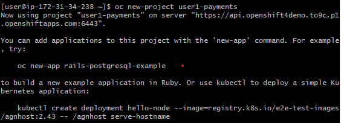

# Lab 3 - Working with OpenShift 4 - Docker at Scale
In this exercise, you will now see how to deploy our sample application to OpenShift. You can either use the OpenShift playground, or you will need access to an Openshift 4 cluster.

In this exercise you will complete the following tasks:

1. You will run a container from the terminal
2. You will then visit the Web based management console of OpenShift to review the project
3. You will test your application through the Web browser

## Prerequisites
Before you start you will need need a login to the Openshift cluster.

## Part 1: Logging in to OpenShift

1.  First visit the web console and log in using the username and password provided. 

2. We also want to log into Openshift using its command line tool **oc**. We can get the login command to run from the web console. Click on the **?** symbol next to your username, then click on **Command line tools**.


3. Click on the **Copy Login Command** link.  You will need to log in again. Then click on **display token**.

4. In the "Log in with this token section", **copy the full line** that starts with oc login. Open a command prompt on your VM, and **paste** this in and press **enter**.

## Part 2: Create an application from the terminal
If you recall, OpenShift uses the concept of a project to act as a namespace for our applications. So we will create both a project and then the application. The application will be based upon an image that is in a public Docker repository.

As many users will share the cluster, and each project name must be unique, for this lab we will ensure our project names start with your OpenShift login name.

1. To create a new project, run the following command:

```oc new-project [YOUR-NAME]-payments``` (change [YOUR-NAME] for your OpenShift login name)



2. You will now create a new project using a Docker image from a repository that is a basic Java REST API. To create the application within the project, you can point OpenShift directly to the Docker image. So run the following command:

```oc new-app public.ecr.aws/e2r0q3k0/payment-gateway```


3. That's it! You have deployed the new application to OpenShift. Note the message you get after it has deployed. You can run `oc status` to see the state of your application. Try that now:

```oc status```

It will show that there were two deployments. One of these was created by OpenShift internally to do the work of getting the image and creating the application, and the second is the application itself.

4. Let's see the details of the container - in OpenShift and Kubernetes, a running container is contained within a pod. Run `oc get pod`  to see the pods in the current project:

```oc get pod```

You should see that there is 1 running pod. 

5. You now need to get the routing set up for the application. There is a command to sort this out as well. So at the terminal, run:

```oc expose service/payment-gateway```


5. To find out the URL, you can use ```oc status``` again.

6. Locate the link in the output and navigate to that link in the browser. You will see the swagger page for the application. 


## Part 3: Review the Application in the Web Console

A new application can be set up either from the Web console or the terminal. Let's take a look at the Web console to see what has been created for us.

1. Once signed in to the web console, at the top left, check that you are in the Developer view. If the drop down currently contains the text **Administrator**, select **Developer**. This switches the view in OpenShift from a admin centric view to a developer centric view.

2. Click on **Topology** on the left menu.
   
2. At the top of the screen is another dropdown where you can select your projects. Click on **All Projects**. There will be many projects, so to find yours, in the Name search box, start typing your OpenShift login name (remember you named your project with this prefix).


5. Click on the **[YOUR-NAME]-[PROJECT-NAME]**.

6. You will now see a screen showing all the applications in your project. Each application is represented by a blue circle, with the project name below it.


7. To visit the URL for the project, click on the **open url icon** at the top right of the project circle.


8. To see the details of the project, **click on the project circle or the project name**. This will open a separate panel. 

9. In the **resources** tab of the project details panel, notice the routing that was set up for the project. You can also see here there is 1 pod and a service. 

10. Select the **observe** tab to see the CPU and memory usage of your application.

11. In the **resources** tab click on the **view logs** link in the pods section to view the application log. 

12. This has now taken you to the pod details screen. You can click on the **terminal** tab to get an interactive terminal running on the virtual machine - go to this tab and run the `ls` command - you should see the jar file is there.

13. OpenShift deployments are configured using YAML. To see the YAML file, click the **YAML** tab. Review the contents. Although we will not be going through the detail of this as part of our training, you can see the configuration of your running pod. However, you will notice that the image is referenced along with various other configuration properties of the application. 

14. Clean up all the resoruces by deleting the application. Click on **Topology** on the this left hand menu to return to the applications screen, then **right click on the application circle**, and select **delete deployment**.


## Summary

Congratulations! You have now created an application using command line tools, and created a running container on the OpenShift cluster, which is accessible from the internet. We have also seen how to inspect the logs of the container and see how much memory and CPU it is using.