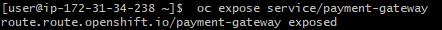

# Module 5 Working with OpenShift 4 - Docker at Scale
In this exercise, you will now see how to deploy our sample application to OpenShift. You can either use the OpenShift playground, or you will need access to an Openshift 4 cluster. 

In this exercise you will complete the following tasks:

1. You will run a container from the terminal
2. You will then visit the Web based management console of OpenShift to configure the routing
3. You will test your application through the Web browser
4. You will then set up a Tekton pipeline for your application to automate the deployment process


## Before you Begin
Before you begin, you will need a terminal on a machine with access to an Openshift 4 cluster. If none is available, then the OpenShift playground will work just fine. To use the OpenShift playground, visit the following URL:

https://developers.redhat.com/learning/learn:openshift:develop-on-openshift/resource/resources:openshift-412-playground

You will be using OpenShift 4.12 for this exercise. There is an OpenShift 4.x as well, but for this exercise, the differences are minor.


## Part 1: Logging in to OpenShift

1. At your terminal where you are logged into your VM (as per the prerequisites), run the following OpenShift command:

```oc login https://api.YOURSERVERDOMAIN:6443 -u YOURUSER -p YOURPASSWORD```

Note that if you are using the OpenShift playground, the Login command is provided for you.


## Part 2: Creating a new Project and Application
If you recall, OpenShift uses the concept of a project to act as a namespace for our applications. So we will create both. The application will be based upon the image that will be created from a project that is in Git.

1. To create a new project, run the following command:

```oc new-project YOUR-NAME-sample-project```


2. You will now create a new project using a Docker image that is already in Dockerhub that is a basic Java REST APi with a simple Web page. To create the application within the project, you can point OpenShift directly to the Docker image. So run the following command:


```oc new-app nicktodd40/compactdiscs```

3. That's it! You have deployed the new application to OpenShift. Note the message you get after it has deployed. You can run `oc status` to see the state of your application. Try that now:

```oc status```

4. You now need to get the routing set up for the application. There is a command to sort this out as well. So at the terminal, run:

``` oc expose service/compactdiscs ```



5. To find out the URL, you can use ```oc status``` again.

6. Locate the link in the output and navigate to that link in the browser. You will see your application again. If you put `/compactdiscs` on the end of the URL you will see the REST API JSON response. The link will be something like:

```
http://compactdiscs-YOUR-NAME-sample-project.apps.YOURDOMAIN/compactdiscs
```

### Login to the Web Console to Review the Application

A new application can be set up either from the Web console or the terminal. Let's take a look at the Web console to see what has been created for us.

1. Using your Web browser, navigate to the URL for your cluster.  If you are using the OpenShift playground, the link is provided in the documentation to the left of your terminal.
   
Your cluster URL will be something like:

```
https://console-openshift-console.apps.DOMAINNAME
```


2. At the OpenShift Web console, sign in using the credentials provided by your instructor, or alternatively, if you are using the OpenShift playground, the credentials are provided in the instructions to the left of your terminal. The defaults are typically just admin/admin.


3. Once signed in, at the top left, select the drop down that currently contains the text **Administrator**, and select **Developer**. This switches the view in OpenShift from a admin centric view to a developer centric view.
   
4. In the left menu, select **Project**. There will be many projects, so to find yours, in the Name search box, start typing your name.


5. Click on the **YOUR-NAME-sample-project**.

6. You will now see a detailed pane showing your live project.


7. To see the routing that was set up for the project, in the **Inventory** pane in the bottom left, select **Routing**. You will see the routing information.

9. Now you will review the Spring Boot logs. Click the back button to return to the project overview page. In the **Inventory** section, select the **1 Pod** link.

10. Select the one running pod, it will have a name something like ```compactdiscs-6cfb8d475c-g9kjn```.

11. At the **Pod Details** screen, select the **Logs** tab. If you scroll to the top of the logs you can clearly see it is showing the boot up log for the Spring Boot application.


12. OpenShift deployments are configured using YAML. To see the YAML file, click the **YAML** tab. Review the contents. Although we will not be going through the detail of this as part of our training, you can see the configuration of your running pod. However, you will notice that the image is referenced along with various other configuration properties of the application. 

13. Leave the browser open and logged into the Openshift console, and keep your terminal open where you logged into Openshift.


## Part 3 Deploy the Application Based on a Project in Git

You have now successfully deployed a project using a pre-built Docker image from Dockerhub. OpenShift can also deploy a project from a Git repository where there is a Dockerfile. When you do it this way, it will automatically check out the project, build the Docker image, and then deploy it.

1. Before you start, check that you have git available at your terminal, so at your terminal, run the following command:
   
```   
git --version
```
2. If git is not installed, you will need to install it. A typical command would be:

```
sudo yum install git
```

However, it will depend upon your machine configurtion. Ask your instructor if you are unsure.

3. Back at your terminal run the following command to create a new project.

```oc new-project YOUR-NAME-sample-project-2```

2. This will create another project in OpenShift. Now create a new application in the project, but point it to the following Git repository. Take a look at the repository in a Web browser before you run this command and note the Dockerfile that is in there.

```oc new-app https://github.com/nicktodd/basicspringapp.git```

This will now take some time to go through and clone the Git repo and then build the image based upon the contents of the Dockerfile.

4. Run the `oc status` command to see how it is progressing.

5. Now also run the following command to add the routing:

``` oc expose service/basicspringapp ```

6. The link to the application will be visible in the console. If you visit this link in a browser, you will see your application.

7. Now return to the OpenShift Web console and explore your new application. You will first locate the docker image that was created to build this application. In the top left drop down where **Developer** is selected, change back to **Administrator**.

8. In the left pane, expand **Builds** and then click **Image Streams**. 
   
9. To make sure you are looking at the correct project, at the top of the page, at the **Project** dropdown, select the YOUR-NAME-sample-project-2 project.
   
10.  Review the two image streams that have been created. One is the newly created docker image for our project. This was created from the Dockerfile in the Git repository:

```
https://github.com/nicktodd/basicspringapp/blob/master/Dockerfile
```

The other image is the parent image which is a JDK docker image from Dockerhub.


11. Finally, to see where the new Docker image has been saved, click on the ```basicspringapp``` image stream.

12. Note the Image Repository location. The repository is within Openshift. It will be something like the below:
```
image-registry.openshift-image-registry.svc:5000/YOUR-NAME-sample-project-2/basicspringapp
```


## Summary

Congratulations! You have successfully deployed an application to OpenShift, once using a Docker image from Dockerhub and then using a Git repository which contains a Dockerfile. In that case, Openshift build the Docker image.


## Summary

In this exercise, you have successfully deployed a an application to OpenShift. 

