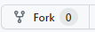
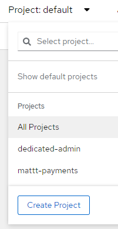

# Lab 4 - Deploying to OpenShift 4 with Pipelines (Github version)
In this exercise we will create a pipeline application, which will be linked to a git repository, and will automatically update the deployed container when changes are committed to git.

In this exercise you will complete the following tasks:

1. You will deploy an application directly from a Github repository, with a Tekton pipeline
2. You will configure the trigger for the pipeline, so that changes to git automatically trigger the build and deployment processes
3. Finally we'll create and run a second pipeline application which will be a front-end to connect to our Spring application, and we'll see how to configure it.

## Prerequisites
**You will need to have your own Github account**. If you would prefer to use Bitbucket rather than Github, [use this lab instead](module6_openshift4_pipelines_bitbucket.md).

It is recommended that you complete this exercise with the supplied sample projects, following which you may wish to experiment with your own projects. 

Before you start you will need also need a login to the Openshift cluster. 

## Part 1: Fork a copy of the projects

You will need to have a copy of the two projects in your own Github account so that you can make changes to the code and configure the automatic build trigger. Repeat the following steps for each of these two git repositories:

* <https://github.com/vppmatt/paymentgateway-standalone> - this is the Spring back-end application.
* <https://github.com/vppmatt/payments-ui> - this is a react based front-end

1. Ensure you are logged in to Github.

2. Visit the project URL for the project.

3. Click on **Fork** at the top right corner of the web page.

4. Do not edit the repository name and leave the checkbox ticked to copy just the master branch.

5. Click on **Create Fork**.

## Part 2: Create an Application with a Pipeline Based on a Project in Git

1. First review the **pom.xml** file for the project and note the version of Java that is expected for this project. This project will run with later versions of Java
but we'll ensure it is configured to run with the version of Java specified in the
pom.xml file.

The pom.xml file can be viewed at <https://github.com/vppmatt/paymentgateway-standalone/blob/main/pom.xml>

2. Ensure you are logged in to the openshift cluster web console and you are in the **Developer** rather than **Administrator** view.

3. Click on the **Project** dropdown and then select the project you created in the previous lab. If you didn't complete that lab, you can create a project by clicking on **Create project**. 

4. Click on **+ADD** on the left menu to add a new application.

5. Click on **import from git** option.

6. Obtain the git url from the Github webpage for the project by clicking on the green **code** button. **Ensure you are using the forked copy of the project in your own Github account**. 

7. Paste this value into the **Git Repo url** box

8. After a few seconds the screen will say that it can build the image using the dockerfile contained in the repository. This will work fine but we don't even need to have a dockerfile. If we didn't have one OpenShift would still know how to deploy this application. It knows it needs to clone the git repository, build the Jar file, and create a Dockerfile. We will see this by changing the settings to build the applicaiton from source code.

Click on **Edit Import Strategy**.

9. Ensure Java is selected and then change the **Builder Image version** to `openjdk-8-ubi8`.

_Note: the Java versions presented contain either ubi or el in the name. These refer to the Redhat licensing options for Java - for details see: <https://developers.redhat.com/blog/2019/10/09/what-is-red-hat-universal-base-image#high_quality__the_security_and_operational_benefits_of_rhel>_

10. Set the **Application name** to `payments`.

11. Set the **Name** to `paymentgateway`.

12. Ensure the **Resource type** is set to `Deployment`.

13. Check the **Add pipeline** box. This will create a 3 step pipeline
(fetch the repository from Github, build the artifacts including the container, create/update the OpenShift deployment and all the resources it needs).

14. Ensure the **target port** is set to `8080`.

15. Check the **create a route** box.

16. Click on **create**.

17. When the topology screen is displayed, notice that the application circle has some additional icons. Click on the **build icon** to watch the build progress.

18. When the build has completed, click on **Topology** in the left menu to get back to the
topology screen, then click the **Open URL** icon to view the application.

You should now be looking at the back-end server application's Swagger page. If you wish, explore the API!

## Part 3 Use the pipeline's webhook to automatically trigger a rebuild when changes are pushed to Github

1. In the web console, click on **Pipelines** in the left menu. 

2. Open the paymentgateway pipeline by clicking on the link in the **Name** column.

3. Copy the **trigger templates** link.

4. Go to the Github page for the application and click on **settings**.

5. Click on **webhooks** in the left menu.

6. Click on **Add webhook**, and paste the URL you copied into the **Payload URL** field.

7. Change the **Content type** to `application/json`. You can leave all the other fields as their default value.

8. Click on **Add webhook**.

9. Make a change to the code within Github and commit it. You can do this either by cloning the
project locally, or you can edit files directly in Github if you prefer:

Find the file **/src/main/java/com/multicode/payments/config/SwaggerConfig.java** and edit the description on line 28. This description appears near the top of the Swagger page.

10. Because we set up the webook, Github should have automatically notified our cluster that the code changed,and this should trigger the pipeline to be re-executed.

11. In the Openshift console, click on **Topology** in the left menu. 

12. The Payment-gateway component should show that a build is currently taking place. Click on the **build icon** to watch the build.

13. When the build has completed, check the live application now shows your new description.

14. Click on **Pipelines** in the left menu and explore the each of the tabs for the pipeline you created in the Openshift console.

## Part 4 Create a pipeline for the front-end application

Repeat the process from parts 2 and 3 above for the second application, starting at point 4 in part 2.

Note the following for this application:

* Be sure to use your forked copy of the application.
* This is a React project which is built using Node.js. When you import the Git repository, OpenShift will detect this and suggest a builder image is used with Node.js v16 - this will be fine, you can accept the default builder image.
* Ensure the **application** is set to `payments` (you will use the same application as before).
* Set the **Name** to `payments-ui`.
* Set the **target port** to `3000`.
* When watching the build you can ignore any warnings about vulnerabilities that might be displayed (although you wouldn't do that in a production application!).
* When the front-end application is deployed, it will not work initially as it has not yet been configured to interact with the back end server. You can visit the url and should see the home page, but it will not be able to get any data. If you view the browser console you'll see an HTTP 404 error.

## Part 5 Configuring the applications

To make our application work we need to provide the front end application with the URL for our rest API. Review the src/data/DataFunctions.js file - the application uses "localhost" unless an environment variable called REACT_APP_SERVER_URL has been set. We therefore need to set this environment variable as part of the build process. We can configure this within the application's definition.

1. Click on the **Topology** link in the left menu.

2. Click on the application circle for the **back-end server application** (payment-gateway)

3. At the right of the screen, go to the **Resources** tab and scroll down to find the **Routes**.

4. Copy the URL shown.

5. We will store this value in a configmap - this will allow us to potentially re-use it in any other application, and it will be easy to locate it and change it if required. Click **ConfigMaps** on the left menu.

6. Click **Create ConfigMap**.

7. Set the **name** to `environment-variables`.

8. Set the **key** to `REACT_APP_SERVER_URL`

9. Set the **value** to the URL you copied in step 4 - you enter this in the box just below the words "Drag and drop file".

10. Click **Create**

11. We can now tell the application to use the value in the config map as an environment variable on the pod that runs the application. Click on **topology** in the left menu.

12. **Right click** on the application circle for the front end application (the node image).

13. Click on **Edit payments-ui** - take care, there are other edit options in this menu - we need to edit the entire application.

14. You will now see the same screen as when you first created the application. Scroll to the bottom and click on the **Deployment** link just above the save button.

15. There are boxes here where we can type in environment variables. Click on *+ Add from ConfigMap or Secret*

16. Set **name** in the second box to `REACT_APP_SERVER_URL`. 

17. Change **Select a Resource** to `environment-variables`, and then **select a key** can be set to the key name you entered.

18. Click on **save**

19. A new pipeline run will start automatically - watch the logs until this is complete

## Part 6 Test the application in the browser

1. Click on the **Topology** link in the left menu.

2 Visit the front-end application by clicking on the **Open URL** icon for the payments-ui application

3. Click on **Find a transaction**

4. Check that a list of countries is shown in the dropdown list.

5. **Chose a country** from the list.

6. Check that some transactions appear on the screen for the selected country.

## Part 7 Tidy up

1. To delete the project and all the resources, first click on the **Topology** link on the left hand menu.

2. Click on the **project** link on the left hand menu.

3. at the top right of hte screen click on **Actions**, then **Delete project**. 

## Summary

Congratulations - in this lab you have deployed two applications to the OpenShift cluster and set up a pipeline. If you commit a change to the code in your Github repositories, those changes will be automatically redeployed to the cluster.
