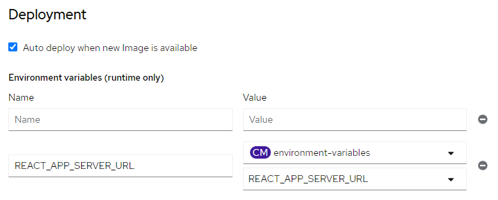

# Lab 4 - Deploying to OpenShift 4 with Pipelines (Bitbucket version)
In this exercise we will create a pipeline application, which will be linked to a git repository, and will automatically update the deployed container when changes are committed to git.

In this exercise you will complete the following tasks:

1. You will deploy an application directly from a Bitbucket repository, with a Tekton pipeline
2. You will configure the trigger for the pipeline, so that changes to git automatically trigger the build and deployment processes
3. Finally we'll create and run a second pipeline application which will be a front-end to connect to our Spring application, and we'll see how to configure it.

Please note that this is a long lab, with a number of complicated steps - take care to follow each step carefully!

## Prerequisites
 **You will need to have your own Bitbucket account**. If you would prefer to use Github rather than Bitbucket, [use this lab instead](module6_openshift4_pipelines.md).

It is recommended that you complete this exercise with the supplied sample projects, following which you may wish to experiment with your own projects.

Before you start you will need also need a login to the Openshift cluster. 

## Part 1: Fork a copy of the projects

You will need to have a copy of the two projects in your own Bitbucket account so that you can make changes to the code and configure the automatic build trigger. Repeat the following steps for each of these two git repositories:

* <https://bitbucket.org/neuedamats/paymentgateway-standalone> - this is the Spring back-end application.
* <https://bitbucket.org/neuedamats/payments-ui> - this is a react based front-end

1. Ensure you are logged in to Bitbucket.

2. Visit the project URL for the project.

3. Click on the **3 dots** at the top right corner of the web page then click on **Fork this repository**.

4. Create a new project (we suggest you call it payments). Do not edit the repository name. You can choose whether to make it a private or public repository.

5. Click on **Fork repository**.

## Part 2: Create an Application with a Pipeline Based on a Project in Git

1. First review the **pom.xml** file for the project and note the version of Java that is expected for this project. This project will run with later versions of Java
but we'll ensure it is configured to run with the version of Java specified in the
pom.xml file.

The pom.xml file can be viewed at <https://bitbucket.org/neuedamats/paymentgateway-standalone/src/main/pom.xml>

2. Ensure you are logged in to the openshift cluster web console and you are in the **Developer** rather than **Administrator** view.

3. Click on the **Project** dropdown and then select the project you created in the previous lab. If you didn't complete that lab, you can create a project by clicking on **Create project**. 

4. Click on **+ADD** on the left menu to add a new application.

5. Click on **import from git** option.

6. Obtain the git url from the Bitbucket webpage for the project by clicking on the **clone** button at the top right of the screen. **Ensure you are using the forked copy of the project in your own Bitbucket account**. 

7. Paste this value into the **Git Repo url** box. Remove the words `git clone` at the start of the line. You must also remove the username from the url. For example it will initially be in the format `https://your-username@bitbucket.org...`.  Tou must change this to `https://bitbucket.org...`

**BE CAREFUL with this step** - if you have the URL in the correct format, then the system will show the word "validated" below the URL. If it says "URL is valid but a git type could not be identified." then you may not have not got the URL in the correct format.

8. It is important that you supply BitBucket credentials **every time** you create a deployment in this way, even if your repo is public. This is because BitBucket limits the amount of anonymous connections that can be made within an hour. If you do not supply credentials, you risk the git pull request timing out. To do this, you will need to know your bitbucket username, and create an app password.

    **Bitbucket**
- Click on the **settings** cog at the top right of the web page.
- Click on **Personal Bitbucket settings**

- Note your **username** shown on this screen under the heading Bitbucket Profile Settings
- On the left hand menu click on **App passwords**
- Click on **Create app password**
- Give the App password a **label** such as `Openshift`
- Tick the **Read** box in the Repositories section. 
- Click on **Create**

- Make a note of the displayed password.

    **Openshift**

- Click on **Advanced Git Options**
- In the **Source Secret** section, click on **Create Secret**
- Give the secret a name such as `bitbucket`
- Enter the username and password you obtained from Bitbucket
- Click on **save**

Note for future deployments, you can re-use this secret that was created within Openshift.

9. After a few seconds the screen should say that a builder image has been detected. This means that OpenShift knows how to deploy this application - we do not need to clone the git repository, build the Jar file, or write a Dockerfile because Openshift knows how to do all of these tasks. However by default it will use the latest version of Java, so we will change that to use the version that the project expects. You do not normally need to do this, but we are exploring the options here so that we can understand what strategies are aviable for building our applications.

Click on **Edit Import Strategy**.

10. Ensure Java is selected and then change the **Builder Image version** to `openjdk-8-ubi8`.

_Note: the Java versions presented contain either ubi or el in the name. These refer to the Redhat licensing options for Java - for details see: <https://developers.redhat.com/blog/2019/10/09/what-is-red-hat-universal-base-image#high_quality__the_security_and_operational_benefits_of_rhel>_

11. Set the **Application name** to `payments`.

12. Set the **Name** to `paymentgateway`.

13. Ensure the **Resource type** is set to `Deployment`.

14. Check the **Add pipeline** box. This will create a 3 step pipeline
(fetch the repository from Bitbucket, build the artifacts including the container, create/update the OpenShift deployment and all the resources it needs).

15. Ensure the **target port** is set to `8080`.

16. Check the **create a route** box.

17. Click on **create**.

18. When the topology screen is displayed, notice that the application circle has some additional icons. Click on the **build icon** to watch the build progress.

19. When the build has completed, click on **Topology** in the left menu to get back to the
topology screen, then click the **Open URL** icon to view the application.

You should now be looking at the back-end server application's Swagger page. If you wish, explore the API!

## Part 3 Use the pipeline's webhook to automatically trigger a rebuild when changes are pushed to Bitbucket

1. In the web console, click on **Pipelines** in the left menu. 

2. Open the paymentgateway pipeline by clicking on the link in the **Name** column.

3. This page contains a link to a trigger template - we need to copy this link and apply it to our BitBucket repository. However BitBucket's webhooks are not compatible with the default trigger template that OpenShift gives us, so we first need to remove the trigger and create a new one.

From the **Actions** menu at the top right, click on **Remove Trigger**. Select the trigger template, and click on **Remove**.

4. From the **Actions** menu at the top right, click on **Add Trigger**. Click on the option to **Select the Git Provider Type**, and start typing `bitbucket` - you need to select the option `bitbucket-cloud-push`.

5. Do not change anything else on this screen, and click on **Add**.

6. Copy the **trigger templates** link.

7. Go to Bitbucket and navigate to the application. Click on **Repository settings** on the left hand menu.

8. In the Workflow section of the left hand menu, click on **Webhooks**.

9. Click on **Add webhook**. Set the Title to `openshift` and and paste the URL you copied into the **URL** field.

10. Ensure the status checkbox for **Active** is checked, and the **Push** option is checked in the Triggers section. 

11. Click on **Save**.

12. Make a change to the code within Bitbucket and commit it. You can do this either by cloning the project locally, or you can edit files directly in Bitbucket if you prefer:

Find the file **/src/main/java/com/multicode/payments/config/SwaggerConfig.java** and edit the description on line 28. This description appears near the top of the Swagger page.

If you are editing the file directly in Bitbucket, ensure you click on **Approve** after you have comitted the change.

13. Because we set up the webook, Bitbucket should have automatically notified our cluster that the code changed,and this should trigger the pipeline to be re-executed.

14. In the Openshift console, click on **Topology** in the left menu. 

15. The Payment-gateway component should show that a build is currently taking place. Click on the **build icon** to watch the build.

16. When the build has completed, check the live application now shows your new description.

17. Click on **Pipelines** in the left menu and explore the each of the tabs for the pipeline you created in the Openshift console.

## Part 4 Create a pipeline for the front-end application

Repeat the process from parts 2 and 3 above for the second application, starting at point 4 in part 2.

Note the following for this application:

* Be sure to use your forked copy of the application.
* This is a React project which is built using Node.js. When you import the Git repository, OpenShift will detect this and suggest a builder image is used with Node.js v16 - this will be fine, you can accept the default builder image.
* Ensure the **application** is set to `payments` (you will use the same application as before).
* Set the **Name** to `payments-ui`.
* Set the **target port** to `3000`.
* When watching the build you can ignore any warnings about vulnerabilities that might be displayed (although you wouldn't do that in a production application!).
* When the front-end application is deployed, it will not work initially as it has not yet been configured to interact with the back end server. You can visit the url and should see the home page, but it will not be able to get any data. If you view the browser console you'll see an HTTP 404 error.

## Part 5 Configuring the applications

To make our application work we need to provide the front end application with the URL for our rest API. Review the src/data/DataFunctions.js file - the application uses "localhost" unless an environment variable called REACT_APP_SERVER_URL has been set. We therefore need to set this environment variable as part of the build process. We can configure this within the application's definition.

1. Click on the **Topology** link in the left menu.

2. Click on the application circle for the **back-end server application** (payment-gateway)

3. At the right of the screen, go to the **Resources** tab and scroll down to find the **Routes**.

4. Copy the URL shown.

5. We will store this value in a configmap - this will allow us to potentially re-use it in any other application, and it will be easy to locate it and change it if required. Click **ConfigMaps** on the left menu.

6. Click **Create ConfigMap**.

7. Set the **name** to `environment-variables`.

8. Set the **key** to `REACT_APP_SERVER_URL`

9. Set the **value** to the URL you copied in step 4 - you enter this in the box just below the words "Drag and drop file".

10. Click **Create**

11. We can now tell the application to use the value in the config map as an environment variable on the pod that runs the application. Click on **topology** in the left menu.

12. **Right click** on the application circle for the front end application (the node image).

13. Click on **Edit payments-ui** - take care, there are other edit options in this menu - we need to edit the entire application.

14. You will now see the same screen as when you first created the application. Scroll to the bottom and click on the **Deployment** link just above the save button.

15. There are boxes here where we can type in environment variables. Click on *+ Add from ConfigMap or Secret*

16. Set **name** in the second box to `REACT_APP_SERVER_URL`. 

17. Change **Select a Resource** to `environment-variables`, and then **select a key** can be set to the key name you entered.

18. Click on **save**

19. A new pipeline run will start automatically - watch the logs until this is complete

## Part 6 Test the application in the browser

1. Click on the **Topology** link in the left menu.

2 Visit the front-end application by clicking on the **Open URL** icon for the payments-ui application

3. Click on **Find a transaction**

4. Check that a list of countries is shown in the dropdown list.

5. **Chose a country** from the list.

6. Check that some transactions appear on the screen for the selected country.

## Part 7 Tidy up

1. To delete the project and all the resources, first click on the **Topology** link on the left hand menu.

2. Click on the **project** link on the left hand menu.

3. At the top right of the screen click on **Actions**, then **Delete project**. 

## Summary

Congratulations - in this lab you have deployed two applications to the OpenShift cluster and set up a pipeline. If you commit a change to the code in your Bitbucket repositories, those changes will be automatically redeployed to the cluster.
