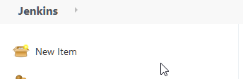
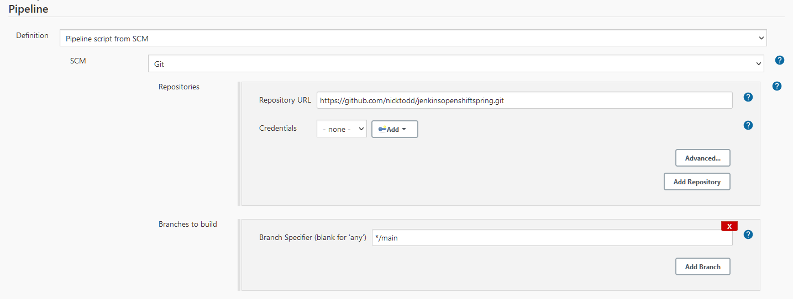
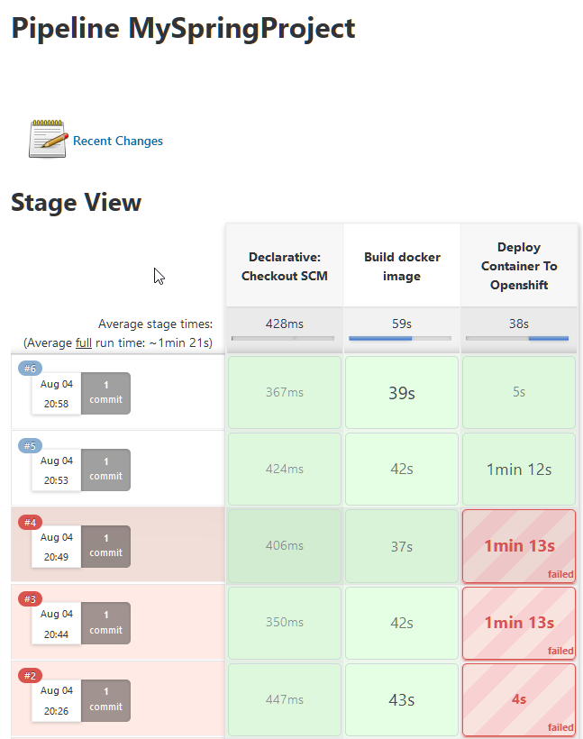

# Use a Locally Running Jenkins to Deploy a Locally Running OpenShift 3 Cluster

In this exercise you will use Jenkins to build a Spring Boot application and then deploy it to an OpenShift Server.

## Prerequisites

In order to complete this exercise, you can either modify one of your own Spring projects, or you can use a sample one.

If you wish to use your own project, you must already have the following

* A Java SpringBoot application in a Git repository
* A Dockerfile that can be used to successfully package up the application in Docker. If this cannot be demonstrated on your local computer, then it will not work when you try and deploy it via Jenkins
* The Docker image should have successfully been run on OpenShift before

Alternatively, you can use the sample project which is already set up and ready to be deployed. If you wish to use this sample project, review the Jenkinsfile in part 1 but start at part 2. Your Git repository is as follows:

```
https://github.com/nicktodd/jenkinsopenshiftspring
```

## Part 1 Create the Jenkinsfile

1. Open your Java SpringBoot project in your preferred IDE.
2. Your project requires a Jenkinsfile that is typically within the root of the project folder structure, so create a blank Jenkinsfile in your project.
3. Within the Jenkinsfile add the following:

```
def projectName = 'demospring'
def version = "0.0.${currentBuild.number}"
def dockerImageTag = "${projectName}:${version}"

pipeline {
  agent any

  stages {
     stage('Build docker image') {
          // this stage also builds and tests the Java project using Maven
          steps {
            sh "docker build -t ${dockerImageTag} ."
          }
      }
    stage('Deploy Container To Openshift') {
      steps {
        sh "oc login https://localhost:8443 --username admin --password admin --insecure-skip-tls-verify=true"
        sh "oc project ${projectName} || oc new-project ${projectName}"
        sh "oc delete all --selector app=${projectName} || echo 'Unable to delete all previous openshift resources'"
        sh "oc new-app ${dockerImageTag} -l version=${version}"
        sh "oc expose svc/${projectName}"
      }
    }
  }
}


```

4. Commit and push your changes to your Git repository.


## Part 2 Create the Jenkins build
You have been provided with a Linux machine that already has both Jenkins and Openshift installed on it. You will use this machine to complete the exercise.

1. Using a browser, visit your Jenkins server URL, it will be something like: http://MACHINENAME:8080

2. At the Jenkins interface, login using the credentials provided by your instructor.



3. In the Jenkins console, click **New Item**.

4. At the **Enter an Item Name** field, enter `MySpringProject` and then select **Pipeline** and click **OK**.

5. At the **General** page, scroll down to the **Pipeline** section and at the **Definition** field, select **Pipeline script from SCM**.

6. For the **SCM**, select **Git**, and in the **Repository URL** enter your Git repository location. If it not public, add the Credentials.

7. At the **Branches to build** section, change the branch name from `*/master` to `*/main`.



8. Deselect the **Lightweight checkout** option.

9.  Now click **Save**.

## Part 3 Run the Jenkins build

1. At the **Pipeline** screen, you can now click **Build Now**.

2. You will see a series of (hopefully) three green squares as it completes the three stages of the Jenkins build.




## Part 4 Testing your Application in the Browser

Once your application is deployed, you can verify that is in OpenShift by logging into the OpenShift console and locating your new application and selecting its routing link.

1. Using your Web browser, login to your OpenShift server. It is running on the same  machine as the Jenkins server, so the URL will be something like:

https://MACHINENAME:8443

2. At the login screen, enter your credentials, which are typically admin/admin for a temporary test installation.

3. On the right, you will see your project in the list of projects.


You will likely only have one project in your list!

4. Select your project.

5. Expand your project in the main screen.

  

6. You will see your running pod, and above it, you will see the URL to your application. You can click on the link to see your running SpringBoot application. 


## Part 5 Deploying an Application that uses a Database

The application deployed so far is a standalone application that has no database. You are now going to see how an application could be deployed that uses a database at the backend. 

For convenience, if you are using one of our OpenShift servers, we have installed MySQL on it for you, so you can make that machine the database used by your application. If you are using our lab environment, the username and password for MySQL is conygre/C0nygre-C0nygre and you can connect to it from your MySQL Workbench.

To complete this exercise, you will need a Git repository containing a SpringBoot application. You can take a copy of the following project if you would like to and then make the necessary changes to it.

https://github.com/nicktodd/jenkinsopenshiftspringdatabase


Get the code from this project into your own Git repository. An easy way to complete this is to clone the repository above, and copy the files from it into an empty Git repository that you have created.

Once you have that project complete, you will need to connect to your remote database to set up the necessary tables.

