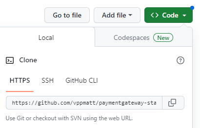

# Introducing OpenShift 4
In this exercise we will deploy and configure two applications to the Openshift platform from their source code. 

## Prerequisites
Before you start you will need a login to the Openshift cluster which your instructor will provde. 

## Part 1: Review the projects

The application we will deploy is made up of two projects. One is a Java based application which provides the "back-end" or "server" functionality. The second is a Javascript/React based application which provides the user iterface. 

The source code for the two projects can be found on the internet at the following websites. We can get Openshift to take the code directly from here, so you don't need to get a local copy, but if you wish to review some of the code you are welcome to do so!

* <https://github.com/vppmatt/paymentgateway-standalone> - this is the Spring back-end application.
* <https://github.com/vppmatt/payments-ui> - this is a react based front-end

## Part 2: Create An application in Openshift

1.  First visit the Openshift web console and log in using the username and password provided by your instructor. 

2. Select the **Developer** rather than **Administrator** view.

3. Click on the **Project** dropdown and then click on **Create project**.  Give the project a name that includes your Openshift login name, so that it's different from the other participants.

4. Click on **+ADD** on the left menu to add a new application.

5. Click on **import from git** option. This is to tell Openshift we are getting the source code for the project from a website that runs the Git Version Control system.

6. In a separate browser tab, visit the Github webpage for the server application (<https://github.com/vppmatt/paymentgateway-standalone>) and click  on the green **code** button.  Then click on the copy link to copy the URL shown.

7. In the Openshift web console, paste the value you copied into the **Git Repo url** box.

8. After a few seconds the screen should say that a builder image has been detected. This means that Openshift knows how to deploy this application - we do not need to get a copy of the code, build the application, or write a Dockerfile because Openshift knows how to do all of these tasks. However by default it will use the latest version of Java, so we will change that to use a specific version that the project expects.

Click on **Edit Import Strategy**.

9. Ensure Java is selected and then change the **Builder Image version** to `openjdk-8-ubi8`.

_Note: the Java versions presented contain either ubi or el in the name. These refer to the Redhat licensing options for Java - for details see: <https://developers.redhat.com/blog/2019/10/09/what-is-red-hat-universal-base-image#high_quality__the_security_and_operational_benefits_of_rhel>_

10. Set the **Application name** to `payments`.

11. Set the **Name** to `paymentgateway`.

12. Ensure the **Resource type** is set to `Deployment`.

13. Ensure the **target port** is set to `8080`.

14. Check the **create a route** box.

15. Click on **create**.

16. When the topology screen is displayed, notice that the application circle has some additional icons. Click on the **build icon** to watch the build progress.

17. When the build has completed, click on **Topology** in the left menu to get back to the
topology screen, then click the **Open URL** icon to view the application.

You should now be looking at the back-end server application's Swagger page. This allows us to explore the API - you are welcome to play around with this!

**Congratulations** - you have now deployed an application from source code to the clould and anyone with internet access can use it!

## Part 3 Deploy the front-end application

Repeat the process from part 2 above for the second application, starting at point 4.

Note the following for this application:

* The url for the second project is: * <https://github.com/vppmatt/payments-ui> 
* This is a React project which is built using Node.js. When you import the Git repository, OpenShift will detect this and suggest a builder image is used with Node.js v16 - this will be fine, you can accept the default builder image.
* Ensure the **application** is set to `payments` (you will use the same application as before).
* Set the **Name** to `payments-ui`.
* Set the **target port** to `3000`.
* When watching the build you can ignore any warnings about vulnerabilities that might be displayed (although you wouldn't do that in a production application!).
* When the front-end application is deployed, it will not work initially as it has not yet been configured to interact with the back end server. You can visit the url and should see the home page, but it will not be able to get any data. If you view the browser console you'll see an HTTP 404 error.

## Part 4 Configuring the applications

To make our application work we need to provide the front end application with the URL for our rest API. The application has been set up to use an environment variable called REACT_APP_SERVER_URL. We therefore need to set this environment variable as part of the build process. We can configure this within the application's definition.

1. Click on the **Topology** link in the left menu.

2. Click on the application circle for the **back-end server application** (payment-gateway)

3. At the right of the screen, go to the **Resources** tab and scroll down to find the **Routes**.

4. Copy the URL shown.

5. We will store this value in a configmap - this will allow us to potentially re-use it in any other application, and it will be easy to locate it and change it if required. Click **ConfigMaps** on the left menu.

6. Click **Create ConfigMap**.

7. Set the **name** to `environment-variables`.

8. Set the **key** to `REACT_APP_SERVER_URL`

9. Set the **value** to the URL you copied in step 4 - you enter this in the box just below the words "Drag and drop file".

10. Click **Create**

11. We can now tell the application to use the value in the config map as an environment variable on the pod that runs the application. Click on **topology** in the left menu.

12. **Right click** on the application circle for the front end application (the node image).

13. Click on **Edit payments-ui** - take care, there are other edit options in this menu - we need to edit the entire application.

14. You will now see the same screen as when you first created the application. Scroll to the bottom and click on the **Deployment** link just above the save button.

15. There are boxes here where we can type in environment variables. Click on *+ Add from ConfigMap or Secret*

16. Set **name** in the second box to `REACT_APP_SERVER_URL`. 

17. Change **Select a Resource** to `environment-variables`, and then **select a key** can be set to the key name you entered.

18. Click on **save**

19. A new build run will start automatically - watch the logs until this is complete

## Part 5 Test the application in the browser

1. Click on the **Topology** link in the left menu.

2 Visit the front-end application by clicking on the **Open URL** icon for the payments-ui application

3. Click on **Find a transaction**

4. Check that a list of countries is shown in the dropdown list.

5. **Chose a country** from the list.

6. Check that some transactions appear on the screen for the selected country.

## Part 6 Tidy up

1. To delete the project and all the resources, first click on the **Topology** link on the left hand menu.

2. Click on the **project** link on the left hand menu.

3. at the top right of hte screen click on **Actions**, then **Delete project**. 

