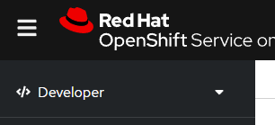
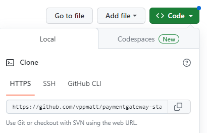
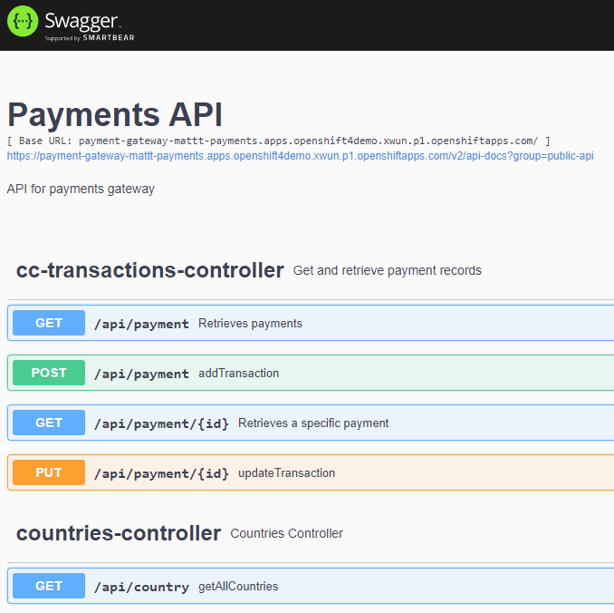

# Use Openshift 4 Pipelines (Tekton) to Build and Deploy to an OpenShift 4 Cluster

In this exercise you will use the pipelines feature of Openshift to deploy a Spring Boot application with a React front end to an OpenShift 4 cluster.

## Prerequisites

It is recommended that you complete this exercise with the supplied sample projects, following which you may wish to experiment with your own projects. You will need to have your own Git repository.

## Part 1 Fork a copy of the projects

You will need to have a copy of the two projects in your own Github account. Repeat the following steps for these two git repositories:

* <https://github.com/vppmatt/paymentgateway-standalone> - this is the Spring back-end application.
* <https://github.com/vppmatt/payments-ui> - this is a react based front-end

1. Ensure you are logged in to Github.
2. Visit the project URL for the project.
3. Click on **Fork** at the top right corner of the web page.

4. Do not edit the repository name and leave the checkbox ticked to copy just the master branch.
5. Click on **Create Fork**.

## Part 2 Create an application with a pipeline

We will use the web console to deploy the Spring Back-end project (payment-gateway).

1. Review the **pom.xml** file for the project and note the version of Java that is expected
for this project. This project will run with later versions of Java
but we'll ensure it is configured to run with the version of Java specified in the
pom.xml file.
2. Log in to the openshift cluster web console.
3. Ensure you are in **Developer** rather than **Administrator** mode.

4. Click on the **Project** dropdown and then click on **Create project**. Give the project a name that contains your name, so that it's unique on the cluster (e.g. matt-payments).

5. If the left menu is not visible, make it visible by clicking on the **3 bars next to the RedHat logo**.

6. Click on **+ADD** to add a new application.
7. Choose the **import from git** option.
8. Obtain the git url from the Github webpage for the project by clicking on the code button. 

9. Paste this value into the **Git Repo url** box
10. The screen should say that a builder image has been detected. By default this will use the latest version of Java.
Click on **Edit Import Strategy**.
11. Ensure Java is selected and then change the **Builder Image version** to `openjdk-8-ubi8`.

_Note: the Java versions presented contain either ubi or el in the name. These refer to the Redhat licensing options for Java - for details see: <https://developers.redhat.com/blog/2019/10/09/what-is-red-hat-universal-base-image#high_quality__the_security_and_operational_benefits_of_rhel>_

12. Set the **Application** to `payments`.
13. Set the **Name** to `payment-gateway`.
14. Ensure the **Resource type** is set to `Deployment`.
15. Check the **Add pipeline** box. This will create a 3 step pipeline
(fetch the repository from Github, build the artifacts including the container, create/update the Openshift deployment and all the resources it needs).
16. Ensure the **target port** is set to `8080`.
17. Check the **create a route** box.
18. Click on **create**.
19. When the topology screen is displayed, click on the **build icon** to watch the build progress.

20. When the build has completed, click on **Topology** in the left menu to get back to the
topology screen, then click the **Open URL** icon to view the application.

You should now be looking at the back-end server application's Swagger page. If you wish, explore the API!

## Part 3 Use the pipeline's webhook to automatically trigger a rebuild when changes are pushed to Github

1. In the web console, click on **Pipelines** in the left menu. 
2. Open the payment-gateway pipeline by clicking on the link in the **Name** column.
3. Copy the **trigger templates** link.
4. Go to the Github page for the application and click on **settings**.
5. Click on **webhooks** in the left menu
6. Click on **Add webhook**, and paste the URL you copied into the **Payload URL** field.
7. Change the **Content type** to `application/json`. You can leave all the other fields as their default value.
8. Click on **Add webhook**.
9. Make a change to the code within Github and commit it. You can do this either by cloning the
project locally, or you can edit files directly in Github if you prefer:

Find the file **/src/main/java/com/multicode/payments/config/SwaggerConfig.java** and edit the description on
line 28. This description appears near the top of the Swagger page.

10. Because we set up the webook, Github should have automatically notified our cluster that the code changed,
and this should trigger the pipeline to be re-executed.
11. In the Openshift console, click on **Topology** in the left menu. 
12. The Payment-gateway component should show that a build is currently taking place.
Click on the **build icon** to watch the build.
13. When the build has completed, check the live application now shows your new description.
14. Click on **Pipelines** in the left menu and explore the each of the tabs for the pipeline you created in the Openshift console.

## Part 4 Create a pipeline for the front-end application

Repeat the process from parts 2 and 3 above for the second application. Start at point 5 in part 1.

Note the following for this application:

* This is a React project which is built using Node.js. When you import the Git repository, Openshift will detect this and suggest a builder image is used with Node.js v16 - this will be fine, you can accept the default builder image.
* Ensure the **application** is set to `payments` (the same application as before).
* Set the **Name** to `payments-ui`.
* Change the **target port** from `8080` to `3000`.
* When watching the build you can ignore any warnings about vulnerabilities that might be displayed (although you wouldn't do that in a production application!).
* When the front-end is deployed, it will not work initially as it has not yet been configured to interact with the back end server. 
You can visit the url but it will not be able to get any data -  if you view the browser console you'll see an HTTP 404 error.

## Part 5 Linking the applications

To make our application work we need to edit the server name. Before starting this section, ensure you have set up the webhook for the application in Github.

1. Click on the **Topology** link in the left menu.
2. Click on the image for the **back-end server application** (payment-gateway)
3. At the right of the screen, go to the **Resources** tab and scroll down to find the **Routes**.
4. Copy the URL shown.
5. We now need to make a change to front-end application code. You can do this either by cloning the
project locally, or you can edit files directly in Github if you prefer:

Find the file **/src/data/DataFunctions.js** and edit line 3 so that the server is set to the value you copied.

6. Commit the changes, wait for the rebuild to complete.

## Part 6 Test the application in the browser

1. Visit the front-end application by clicking on the **Open URL** icon
2. Click on **Find a transaction**
3. Chose a country
4. Check that some transactions appear on the screen for the selected country.
